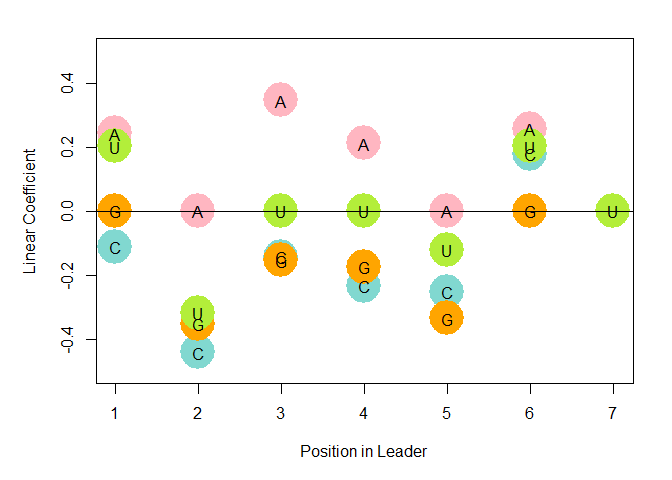
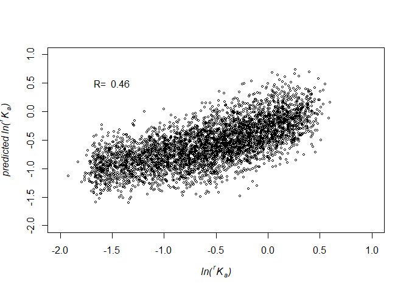

Position Weight Matrix (PWM) Model
==================================

This is the .R script to analysis the position weigh mat.rix linear
model for your RNA/DNA HiTS-Kin/EQ catalysis/binding analysis. In PWM
model, each position/nucleotide is Independent and identically
distributed random variable. In another word, they don't have
"interactions." To proceed the PWM analysis for your HiTS-Kin/EQ
dataset, please prepare the character table as following format

    head(data)

    ##   hexamer        RK LNRK A6 C6 G6 T6 A5 C5 G5 T5 A4 C4 G4 T4 A3 C3 G3 T3
    ## 1  AAAAAA 1.3009072   NA  1  0  0  0  1  0  0  0  1  0  0  0  1  0  0  0
    ## 2  AAAAAC 1.3189136   NA  1  0  0  0  1  0  0  0  1  0  0  0  1  0  0  0
    ## 3  AAAAAG 1.0000000   NA  1  0  0  0  1  0  0  0  1  0  0  0  1  0  0  0
    ## 4  AAAAAT 1.4925469   NA  1  0  0  0  1  0  0  0  1  0  0  0  1  0  0  0
    ## 5  AAAACA 1.5245688   NA  1  0  0  0  1  0  0  0  1  0  0  0  1  0  0  0
    ## 6  AAAACC 0.3942829   NA  1  0  0  0  1  0  0  0  1  0  0  0  1  0  0  0
    ##   A2 C2 G2 T2 A1 C1 G1 T1
    ## 1  1  0  0  0  1  0  0  0
    ## 2  1  0  0  0  0  1  0  0
    ## 3  1  0  0  0  0  0  1  0
    ## 4  1  0  0  0  0  0  0  1
    ## 5  0  1  0  0  1  0  0  0
    ## 6  0  1  0  0  0  1  0  0

File list
---------

Please prepare the following files: Character table in .csv format:
transpose\_table.csv PWM.R

Setting parameters
------------------

First we need to define how many random nucleotides in your binding
region. For example, if we randomize 6 nucleotides inthe binding region,
NNNNNN, we can set this value in PWM.R file to 6.

    howmany <- 6

Then we need to set the input file name in the filename part. Here our
input .csv file is named "transpose\_table.csv."

    filename = "transpose_table.csv"

Data visualization - Bubble Plot
--------------------------------

Prediction and evaluation
-------------------------

After fitting our model, we used the same data to evaluate our model to
see if the PWM model can describe our dataset.

Summary of the PWM model
------------------------

The model summary can be shown by the following code:

    summary(lcf)

    ## 
    ## Call:
    ## lm(formula = lc ~ data$LNRK)
    ## 
    ## Residuals:
    ##     Min      1Q  Median      3Q     Max 
    ## -1.0532 -0.1889  0.0009  0.1815  0.9711 
    ## 
    ## Coefficients:
    ##              Estimate Std. Error t value Pr(>|t|)    
    ## (Intercept) -0.308166   0.006238  -49.40   <2e-16 ***
    ## data$LNRK    0.459425   0.007789   58.99   <2e-16 ***
    ## ---
    ## Signif. codes:  0 '***' 0.001 '**' 0.01 '*' 0.05 '.' 0.1 ' ' 1
    ## 
    ## Residual standard error: 0.2804 on 4094 degrees of freedom
    ## Multiple R-squared:  0.4594, Adjusted R-squared:  0.4593 
    ## F-statistic:  3479 on 1 and 4094 DF,  p-value: < 2.2e-16

In this demo, the PWM model only can describe 46% of the HiTS-EQ
dataset.
