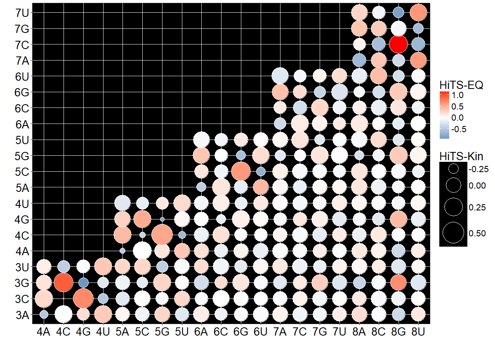

# Data Visualization of Position Weight Matrix (PWM) and PWM plus Interaction Terms

For the R codes of visualization for position weight matrix model, please refer to the PWM folder. The R code will generate the following figure.\
\
For the R codes for PWM + IC model, please go to the folder. The R codes will generate the bobble chart from the character table or the RNA sequences.

